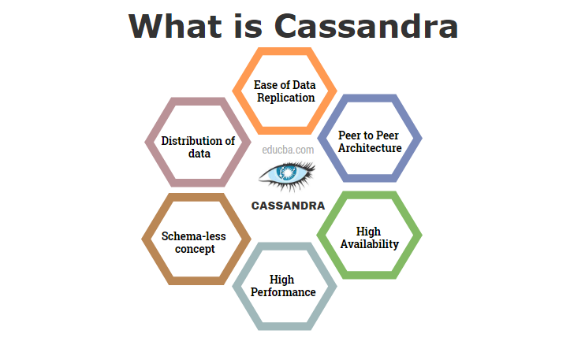

# 2.Cassandra ETL Project
 Egypt FWD Data Enginner

# Project Overview
In this project, I'll apply what I've learned on data modeling with Apache Cassandra and complete an ETL pipeline using Python. To complete the project, I will need to model My data by creating tables in Apache Cassandra to run queries. I provided with part of the ETL pipeline that transfers data from a set of CSV files within a directory to create a streamlined CSV file to model and insert data into Apache Cassandra tables.

We have provided you with a project template that takes care of all the imports and provides a structure for ETL pipeline you'd need to process this data.

